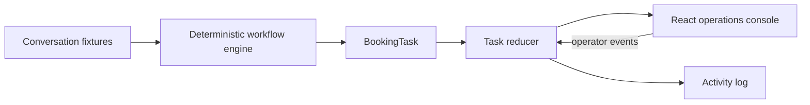

# TrialFlow

TrialFlow is a five-day MVP concept for an AI operations layer for WhatsApp-first service businesses. It focuses on one workflow: turning a WhatsApp-style trial class inquiry into a confirmed booking with visible AI state and human approval.

## Run locally

```bash
npm install
npm run dev
```

Then open the local Vite URL. Build verification: `npm run build`. Logic smoke test: `npm test`.

The implementation-ready local workflow-engine and state-machine design is documented in [WORKFLOW_SPEC.md](./WORKFLOW_SPEC.md).
The portfolio narrative and tradeoffs are documented in [CASE_STUDY.md](./CASE_STUDY.md).
The live presentation flow is documented in [DEMO_SCRIPT.md](./DEMO_SCRIPT.md).

The production target, gates, and phased implementation contract are documented in [PRODUCTION_READINESS.md](./PRODUCTION_READINESS.md).

## Architecture



## Demo path

1. Select Maya Tan in Inbox.
2. Review extracted child age, location, and weekend preference.
3. Select a matching slot and click **Confirm booking**.
4. Click **Send reply** to simulate sending the customer response.
5. Select Farah Q. to see the needs-human exception path.

Additional review fixtures are available in the inbox: **No slots fixture** demonstrates availability escalation, and **Sam Lee** demonstrates unknown-intent escalation.

## Acceptance walkthrough

- Happy path: Maya Tan → Offer slots → select a slot → approve draft → confirm booking → send reply.
- Missing information: Wei Jun → review missing fields → approve/send the follow-up after taking action.
- Human handoff: Farah Q. → inspect reason → Take over before approving or sending.
- No slots: No slots fixture → verify no fabricated slot is shown.
- Unknown intent: Sam Lee → verify the task is escalated with a reason.

## Deliberate MVP boundaries

The WhatsApp channel, availability data, AI extraction, and outbound send are simulated with seeded local state. The console demonstrates the observable workflow, not a production integration. Production work would add provider-backed message ingestion, structured LLM outputs, persistence, Supabase authentication, and scheduling-system integration. The Supabase handoff is documented in [SUPABASE_MIGRATION.md](./SUPABASE_MIGRATION.md).


## Simulated vs production-ready

| Surface | MVP simulation | Production seam |
| --- | --- | --- |
| WhatsApp | Seeded conversation fixtures | Provider webhook and message API |
| AI extraction | Deterministic local parser | Structured model output with validation |
| Availability | Local slot fixtures | Scheduling-system adapter |
| Workflow state | In-memory reducer and activity log | Persistent task store and idempotent workers |
| Replies | Local approval/send simulation | Provider send API with delivery status |
